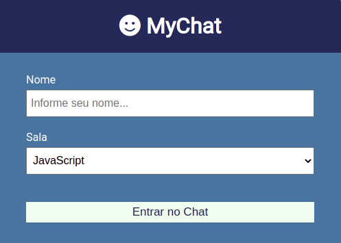
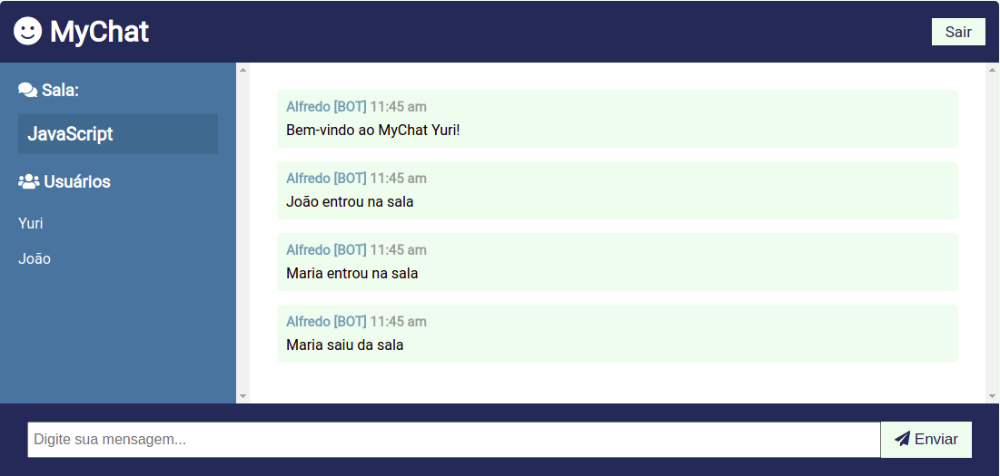

<h1 align="center">
    
</h1>

<h4 align="center"> 
	MyChat - Real-time Application
</h4>

	
  

  
  
  
  
  

  <a href="#sobre">Sobre</a>&nbsp;&nbsp;&nbsp;|&nbsp;&nbsp;&nbsp;
  <a href="#o-que-é-websocket">O que é Websocket</a>&nbsp;&nbsp;&nbsp;|&nbsp;&nbsp;&nbsp;
  <a href="#tecnologias">Tecnologias</a>&nbsp;&nbsp;&nbsp;|&nbsp;&nbsp;&nbsp;
  <a href="#referências">Referências</a>&nbsp;&nbsp;&nbsp;|&nbsp;&nbsp;&nbsp;
  <a href="#licença">Licença</a>

# Sobre

O projeto **MyChat** foi desenvolvido com objetivo de estudar e entender as funcionalidades de uma aplicação em tempo real utilizando websocket.

Nessa aplicação temos um chat divididos por sala onde pode-se criar usuário e definir em quais salas deseja participar.
Sempre que um usuário entrar e sair de uma sala é enviado mensagens automáticas por um "Bot" e possibilita a conversa entre os usuários.
Todas essas mensagens são enviadas em tempo real.

<h1 align="center">
  

  
</h1>

# O que é Websocket?

De maneira resumida,é um **protocolo** que torna possível a comunicação bidirecional entre um navegador e um servidor criando um "túnel" para transportar de forma contínua informações entre o navegador e um servidor.
O **websocket** faz parte das especificações do HTML5 e é suportado pelas últimas versões dos navegadores.

Além de poderoso, este protocolo possui um conceito simples em sua arquitetura. É baseado em **eventos** onde o navegador e o servidor irão emitir eventos um para o outro.

É realizada uma conexão persistente entre o navegador e o servidor para um dos usuários no momento em que entra no chat.
Nessa situação, quando enviasse uma mensagem ao servidor ela é entregue ao "destinatário" sem a necessidade do navegador requisitá-la de forma explícita.

O uso de **websocket** é recomendado em aplicações que demandam comunicação bilateral em tempo real (como um chat), caso não seja esse o caso é melhor utilizar o HTTP.

# Tecnologias

- [Node.JS](https://nodejs.org/en/docs/)
- [Socket.IO](https://www.typescriptlang.org/)
- [Vanilla.JS](http://vanilla-js.com/)

- [Moment](https://momentjs.com/)
- [Nodemon](https://nodemon.io/)
- [Qs CDN](https://github.com/ljharb/qs)

# Referências

https://www.youtube.com/watch?v=T4unNrKogSA

https://www.youtube.com/watch?v=jD7FnbI76Hg&t=67s

## Licença

Esse projeto está sob a licença MIT. Veja o arquivo <a href="https://github.com/yuripalacio/mychat/blob/master/LICENSE">LICENSE</a> para mais detalhes.

By [Yuri Palacio](https://www.linkedin.com/in/yuri-palacio/) :wave:
